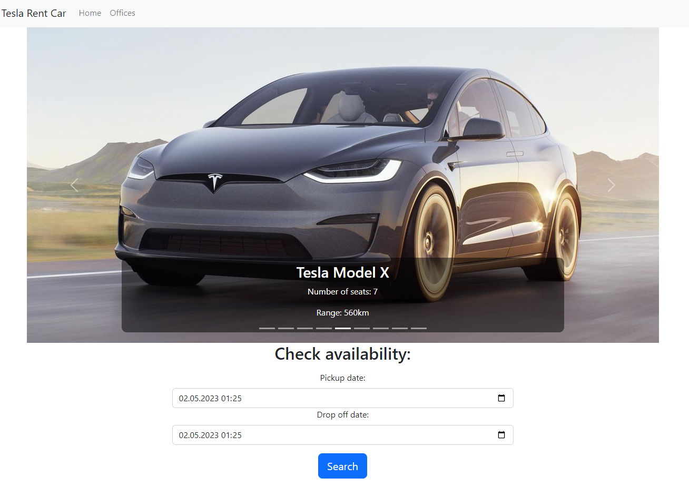

# RentCar.API
Web app for renting Tesla cars in Mallorca. Few locations (Palma Airport, Palma City Center, Alcudia and Manacor) and people can rent and return the cars at any one of them. Possibility to rent all available passenger Tesla models.

## Założenia / Decyzje:
1. Dostarczenie MVP spełniającego wymogi zadania, pominięcie funkcjonalności takich jak logowanie, rejestracja czy autoryzacja.
2. Z racji bliskich odległości biur, każdy samochód może zostać wynajęty w każdym biurze niezależnie od poprzedniej rezerwacji samochodu. Narzucenie stałego odstęu czasowego między rezerwacjami (2h)
3. Koszt liczony od każdej rozpoczętej doby
4. Tylko przykładowe unit testy przy użciu xUnit i Moq
5. React'a z Typescript'em

## How to run:
Make sure, that u have Docker and Docker Compose: https://docs.docker.com/compose/install/
1. `git clone https://github.com/szymongamza/RentCar.git`  
2. `cd RentCar`  
3. `docker compose up`  

React app will run at: http://localhost:3000/  
API Swagger will be at: http://localhost:5245/swagger/index.html
## Screenshots:
 
 
 
 

